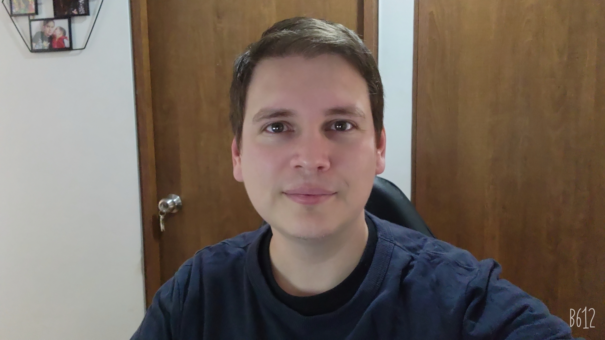

   
   <h3 align="center">👋 ¡Hi I’m Alejandro Vargas! 👋</h3>

I'm <strong>Electronic Enginer</strong> fucused on <strong>Software Developer</strong>
 
I have more than 10 years as a Developer, whit technologies such a
 
<strong>.Net - Angular - React</strong> <small>(among others)</small>

  
  
  

I'm Electronic Engineer, Software enthusiast and video game lover

- 👀 I’m interested in Learn Python and Azure Devops
- 🌱 I’m currently learning React at an Advanced level
- 💞️ I’m looking to collaborate on any project that allows me to learn to grow professionally
- 📫 You can reach me through Linkedin

¡Review my profile 👇!

   

